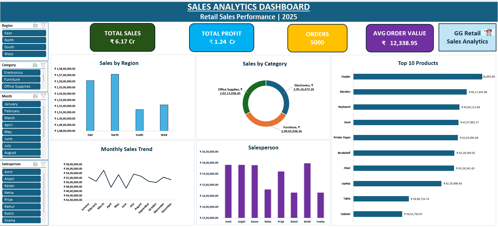

# 📊 Sales Analytics Dashboard

## 📌 Project Overview

This project is an interactive Sales Analytics Dashboard developed in Microsoft Excel to analyze retail sales performance. The dashboard provides business insights into sales, profit, regional performance, product performance, and monthly sales trends using Pivot Tables, Pivot Charts, Slicers, and Excel formulas.

---

## 🎯 Business Problem

Retail businesses generate thousands of sales transactions every month. An interactive dashboard helps management monitor performance, identify trends, and make informed decisions quickly.

---

## 🛠 Tools Used

- Microsoft Excel
- Pivot Tables
- Pivot Charts
- Slicers
- Excel Tables
- Data Cleaning
- Dashboard Design

---

## 📊 Dashboard Features

- Total Sales KPI
- Total Profit KPI
- Total Orders KPI
- Average Order Value
- Sales by Region
- Sales by Category
- Monthly Sales Trend
- Top 10 Products
- Salesperson Performance
- Interactive Slicers

---

## 📸 Dashboard Preview

> 

---

## 💡 Key Business Insights

- North region generated the highest sales.
- Office Supplies contributed the largest share of revenue.
- Sales remained relatively stable throughout the year.
- Stapler and Monitor were among the top-performing products.
- Salesperson performance showed only moderate variation.

---

## 🚀 Skills Demonstrated

- Data Cleaning
- Data Analysis
- Dashboard Design
- Data Visualization
- Business Analysis
- Excel Reporting

---

## 👩‍💻 Author

**Gauri Gupta**

Aspiring Data Analyst
